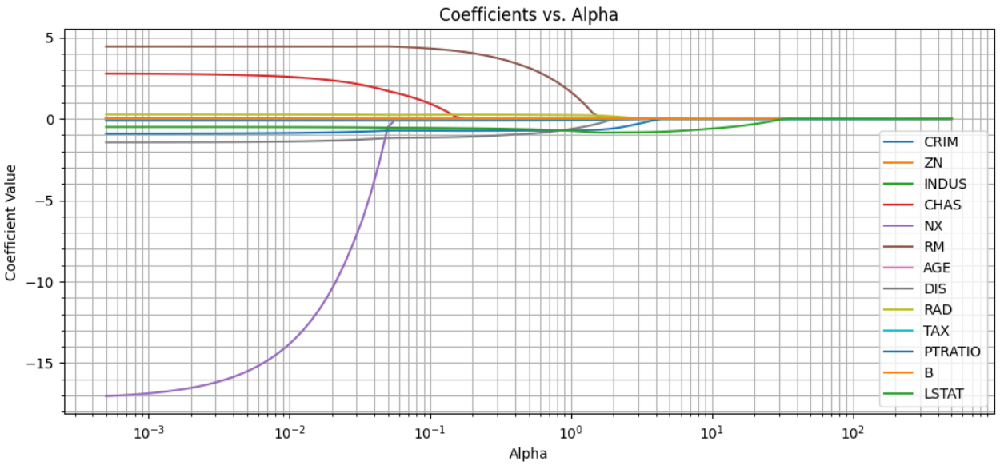
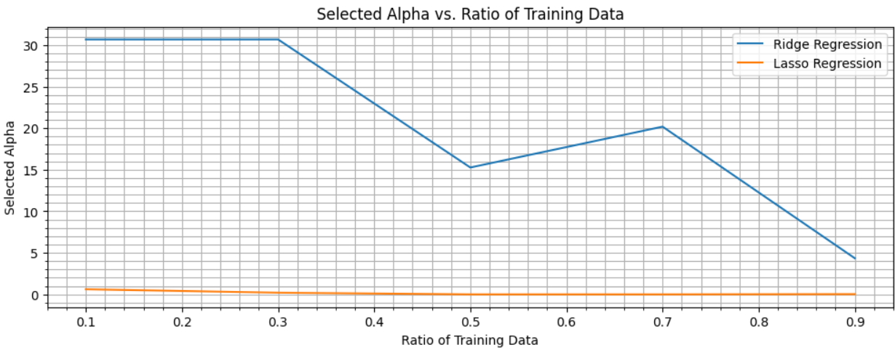
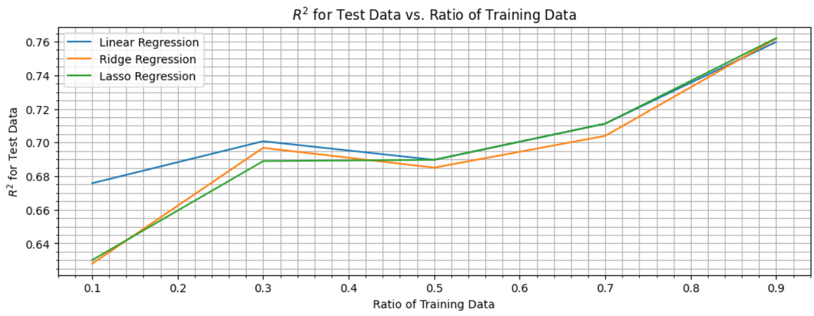
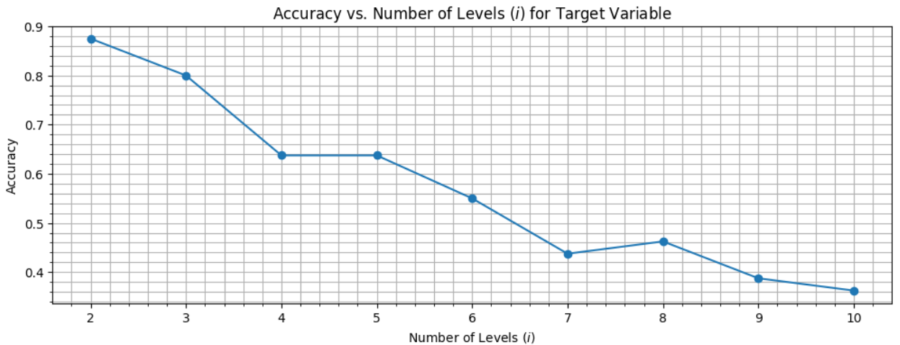
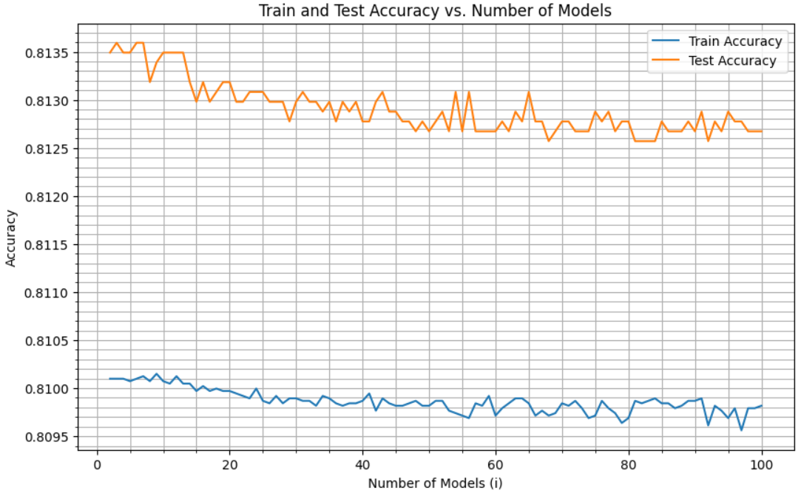
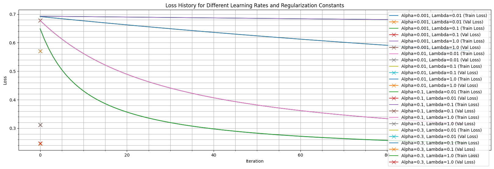

# HW1 — Regression, Logistic Classification, and Ensembles

## Overview

This homework contains three main machine learning parts:

1. **Linear Regression, Ridge, and Lasso Regression**
2. **Logistic Regression, Multinomial Logistic Regression, and Ensemble Methods**
3. **Binary Classification with Logistic Regression, Naive Bayes, and LDA**

The goal was to implement important classical ML models, compare them with built-in models, study regularization, and analyze how hyperparameters affect performance.

---

## Part 1 — Linear, Ridge, and Lasso Regression

This part uses the Boston Housing dataset for regression. The target variable is `MEDV`, and the input features include variables such as `CRIM`, `RM`, `LSTAT`, `TAX`, and `PTRATIO`.

### Models

| Model | Main Idea |
|---|---|
| Linear Regression | Fits a linear relationship between features and target |
| Ridge Regression | Adds L2 regularization to reduce overfitting |
| Lasso Regression | Adds L1 regularization and can shrink some coefficients to zero |

### Main Results

| Model | Train R² | Test R² | Train MSE | Test MSE |
|---|---:|---:|---:|---:|
| Linear Regression | 0.7509 | 0.6688 | 21.64 | 24.29 |
| Ridge Regression | 0.7509 | 0.6688 | 21.64 | 24.29 |
| Lasso Regression | 0.7509 | 0.6687 | 21.64 | 24.29 |

The best alpha selected for both Ridge and Lasso in one experiment was:

```text
alpha = 0.0005
```

Ridge and Lasso performed very similarly to ordinary linear regression on this dataset. This suggests that the original feature set was not severely overfitting for this train/test split.

### Coefficients vs. Alpha

<p align="center">
  
</p>

**Figure 1.** Coefficients shrink as alpha increases. Lasso can push some coefficients close to zero, which makes it useful for feature selection.

### Selected Alpha vs. Training Ratio

<p align="center">
  
</p>

**Figure 2.** Selected alpha changes with the amount of training data. With more training data, less regularization is usually needed.

### R² vs. Training Ratio

<p align="center">
  
</p>

**Figure 3.** Test R² generally improves as the training-data ratio increases. Ridge and Lasso show stable performance as regularized alternatives to linear regression.

---

## Part 2 — Logistic Regression and Ensembles

This part includes binary logistic regression, multinomial logistic regression, and ensemble learning experiments.

### Binary Logistic Regression

A custom logistic regression model was implemented and compared with the built-in scikit-learn model.

| Model | Accuracy | Precision | Recall | F1 Score |
|---|---:|---:|---:|---:|
| Custom Logistic Regression | 0.8750 | 0.8750 | 1.0000 | 0.9333 |
| Built-in Logistic Regression | 0.9375 | 0.9333 | 1.0000 | 0.9655 |

The built-in model performed better, mainly because it uses optimized solvers and more robust regularization settings.

---

### Multinomial Logistic Regression

The target variable was quantized into different numbers of levels, from 2 to 10. The model performed best when the target was divided into 2 levels.

| Number of Levels | Accuracy |
|---:|---:|
| 2 | 0.8750 |
| 3 | 0.8000 |
| 4 | 0.6375 |
| 5 | 0.6375 |
| 6 | 0.5500 |
| 7 | 0.4375 |
| 8 | 0.4625 |
| 9 | 0.3875 |
| 10 | 0.3625 |

<p align="center">
  
</p>

**Figure 4.** Accuracy decreases as the number of quantization levels increases. The model performs best for binary classification.

---

### Adult Income Dataset and Ensembles

The Adult Income dataset was also used for binary classification. The built-in logistic regression model with preprocessing and GridSearchCV achieved:

| Metric | Value |
|---|---:|
| Train Accuracy | 0.8239 |
| Test Accuracy | 0.8275 |

Several ensemble methods were tested:

| Ensemble Method | Test Accuracy |
|---|---:|
| Majority Voting | 0.8135 |
| Average Prediction | 0.8135 |
| Random Forest | 0.8432 |
| AdaBoost | 0.8545 |

The best ensemble method was:

```text
AdaBoost, with test accuracy = 0.8545
```

The number of partial models was also varied from 2 to 100. The best result was:

| Best Number of Models | Train Accuracy | Test Accuracy |
|---:|---:|---:|
| 3 | 0.8101 | 0.8136 |

<p align="center">
  
</p>

**Figure 5.** Train and test accuracy as the number of partial models changes. Increasing the number of models did not always improve performance.

---

## Part 3 — Logistic Regression, Naive Bayes, and LDA

This part uses a binary classification dataset with 10,000 samples and 3 input features.

### Preprocessing

The dataset was normalized using:

$$
x_{norm} = \frac{x - \bar{x}}{\sigma_x}
$$

A bias column of ones was also added to the feature matrix.

| Item | Value |
|---|---:|
| Samples | 10,000 |
| Original features | 3 |
| Features after adding bias | 4 |
| Train size | 7,000 |
| Validation size | 2,000 |
| Test size | 1,000 |

### Implemented Logistic Regression

The implemented logistic regression model used:

- sigmoid function,
- regularized logistic loss,
- gradient descent,
- convergence checking,
- prediction threshold of 0.5.

The final learned parameter vector was:

```text
theta = [-0.0607, -0.1656, 0.2997, 0.0051]
```

The loss decreased during training, showing that gradient descent was working correctly.

<p align="center">
  
</p>

**Figure 6.** Loss curves for different learning rates and regularization constants. Higher learning rates can converge faster, while regularization affects stability and overfitting.

### Classifier Comparison

| Model | Test Accuracy |
|---|---:|
| Logistic Regression | 91.3% |
| Gaussian Naive Bayes | 89.4% |
| Linear Discriminant Analysis | 90.5% |

The best model on this dataset was:

```text
Logistic Regression, with 91.3% test accuracy
```

---

## Key Takeaways

| Topic | Main Takeaway |
|---|---|
| Linear Regression | Gives a strong baseline for regression |
| Ridge | Controls coefficient size using L2 regularization |
| Lasso | Can perform feature selection through L1 regularization |
| Logistic Regression | Worked best for the binary classification dataset |
| Multinomial Logistic Regression | Accuracy decreased as the number of target levels increased |
| Ensembles | AdaBoost gave the best Adult Income result |
| Regularization | Helps control overfitting but must be tuned carefully |


---

## Conclusion

This homework covered regression, classification, regularization, and ensemble learning. Ridge and Lasso behaved similarly to linear regression on the Boston Housing dataset, while Logistic Regression achieved the best accuracy on the binary classification task. In the ensemble section, AdaBoost achieved the strongest Adult Income performance. Overall, the experiments show the importance of preprocessing, regularization, hyperparameter tuning, and model comparison.