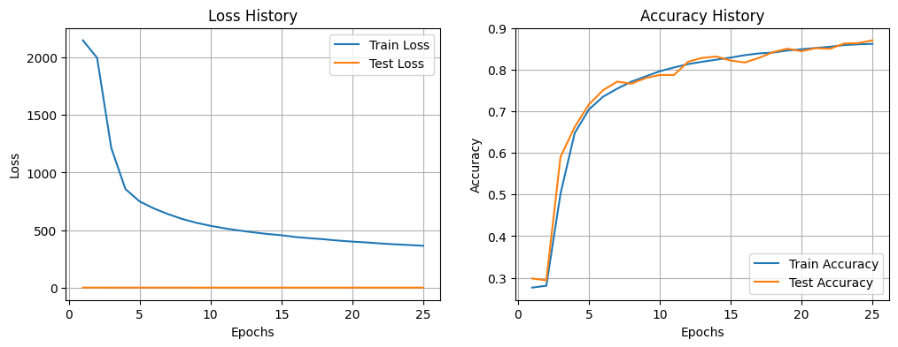
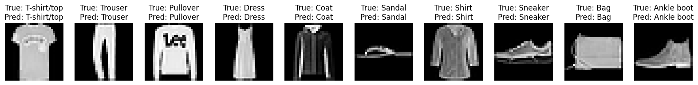
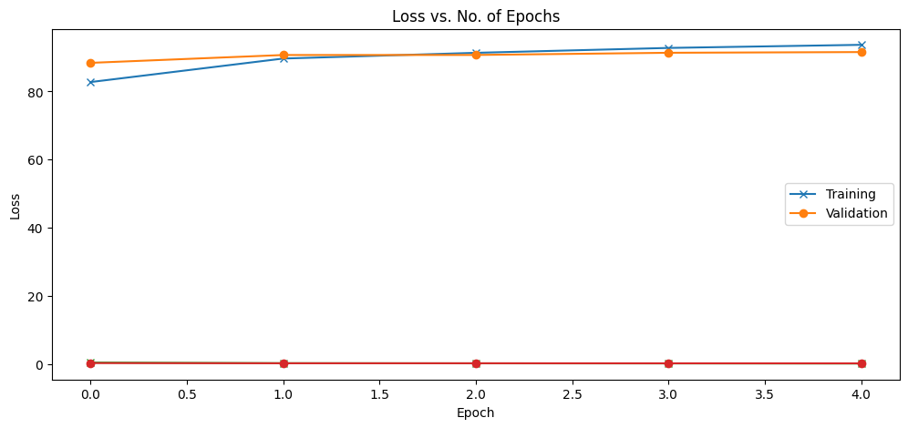
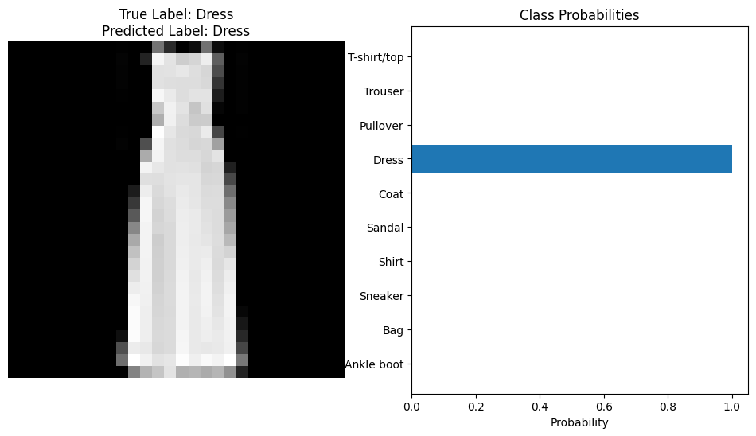
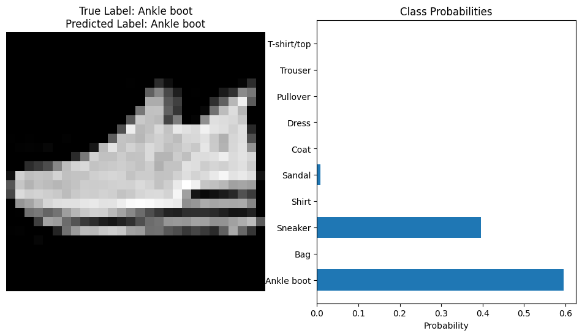
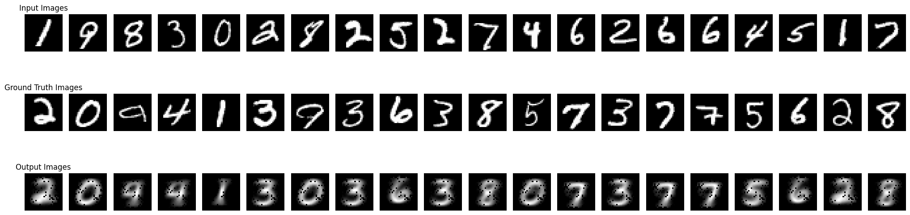

# HW2 — Neural Networks, CNNs, and Autoencoders

## Overview

This homework contains three parts:

1. **Fully connected neural network from scratch** on FashionMNIST  
2. **Convolutional neural network** on FashionMNIST  
3. **Autoencoder** for generating the next MNIST digit image  

The main goal was to implement neural-network models, train them on image datasets, and compare their performance using loss, accuracy, and visual predictions.

---

## Part 1 — Fully Connected Neural Network on FashionMNIST

In this part, a multilayer neural network was implemented mostly from scratch using PyTorch tensors. The model was trained on the FashionMNIST dataset.

| Item | Value |
|---|---:|
| Dataset | FashionMNIST |
| Classes | 10 |
| Image size | 28×28 |
| Input dimension | 784 |
| Epochs | 25 |
| Learning rate | 0.005 |
| Final test accuracy | 87.07% |

The model used several fully connected layers:

```text
784 → 512 → 256 → 128 → 64 → 10
```

The training process showed that accuracy improved steadily as the number of epochs increased.

<p align="center">
  
</p>

**Figure 1.** Loss and accuracy history for the fully connected neural network.

<p align="center">
  
</p>

**Figure 2.** Example FashionMNIST predictions from the trained fully connected model.

---

## Part 2 — CNN on FashionMNIST

In this part, a convolutional neural network was implemented for FashionMNIST classification. Compared with the fully connected model, the CNN can use spatial image structure through convolution and pooling layers.

| Item | Value |
|---|---:|
| Dataset | FashionMNIST |
| Training samples | 48,000 |
| Validation samples | 12,000 |
| Batch size | 64 |
| Epochs | 5 |
| Test accuracy | 87.69% |

The CNN architecture included convolutional layers, max-pooling, fully connected layers, and ReLU activations. The final model had about 1.73M trainable parameters.

Training results:

| Epoch | Train Accuracy | Validation Accuracy |
|---:|---:|---:|
| 1 | 82.75% | 88.38% |
| 2 | 89.65% | 90.68% |
| 3 | 91.33% | 90.70% |
| 4 | 92.76% | 91.34% |
| 5 | 93.67% | 91.55% |

<p align="center">
  
</p>

**Figure 3.** CNN training and validation metrics over 5 epochs.

<p align="center">
  
</p>

**Figure 4.** Correct CNN prediction for a `Dress` sample with high confidence.

<p align="center">
  
</p>

**Figure 5.** CNN prediction for an `Ankle boot` sample. The model predicts the correct class, but also assigns noticeable probability to `Sneaker`.

---

## Part 3 — Autoencoder for Next-Digit Generation

In this part, an autoencoder was trained on MNIST. The task was not ordinary reconstruction; instead, the model received one digit as input and generated the image of the next digit as the target.

For example:

```text
input digit: 1  → target digit: 2
input digit: 9  → target digit: 0
```

The implemented model used a fully connected encoder-decoder architecture.

```text
Encoder: 784 → 512 → 256 → 128 → 64 → 10
Decoder: 10 → 64 → 128 → 256 → 512 → 784
```

Training setup:

| Item | Value |
|---|---:|
| Dataset | MNIST |
| Batch size | 512 |
| Validation batch size | 1024 |
| Optimizer | Adam |
| Learning rate | 0.001 |
| Epochs | 5 |
| Best validation loss | 0.0604 |

Training and validation losses:

| Epoch | Train Loss | Validation Loss |
|---:|---:|---:|
| 1 | 0.0814 | 0.0740 |
| 2 | 0.0716 | 0.0688 |
| 3 | 0.0666 | 0.0642 |
| 4 | 0.0624 | 0.0611 |
| 5 | 0.0605 | 0.0604 |

<p align="center">
  
</p>

**Figure 6.** Input MNIST digits, ground-truth next-digit images, and generated output images from the autoencoder.

---

## Summary

| Part | Model | Dataset | Main Result |
|---|---|---|---|
| Q1 | Fully Connected Neural Network | FashionMNIST | 87.07% test accuracy |
| Q2 | CNN | FashionMNIST | 87.69% test accuracy |
| Q3 | Autoencoder | MNIST next-digit task | Best validation loss = 0.0604 |

---

## Key Takeaways

| Concept | Main Takeaway |
|---|---|
| Fully connected network | Can classify FashionMNIST reasonably well, but ignores spatial structure |
| CNN | Uses local image structure and reached slightly better test accuracy |
| Autoencoder | Learned a compressed representation and generated next-digit images |
| Training curves | Accuracy improved with training, while validation loss helped monitor generalization |
| Model comparison | CNN is more suitable for image classification, while autoencoders are useful for image generation tasks |

---

## Conclusion

This homework implemented three neural-network models for image tasks. The fully connected network and CNN were trained for FashionMNIST classification, with the CNN achieving slightly better test accuracy. The autoencoder was trained on MNIST to generate the next digit image from an input digit. Overall, the assignment shows how different neural architectures are useful for different learning tasks.