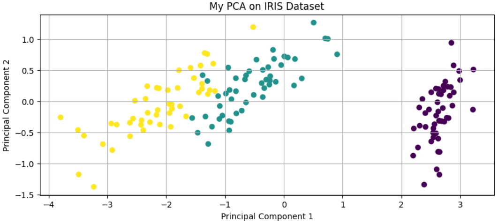
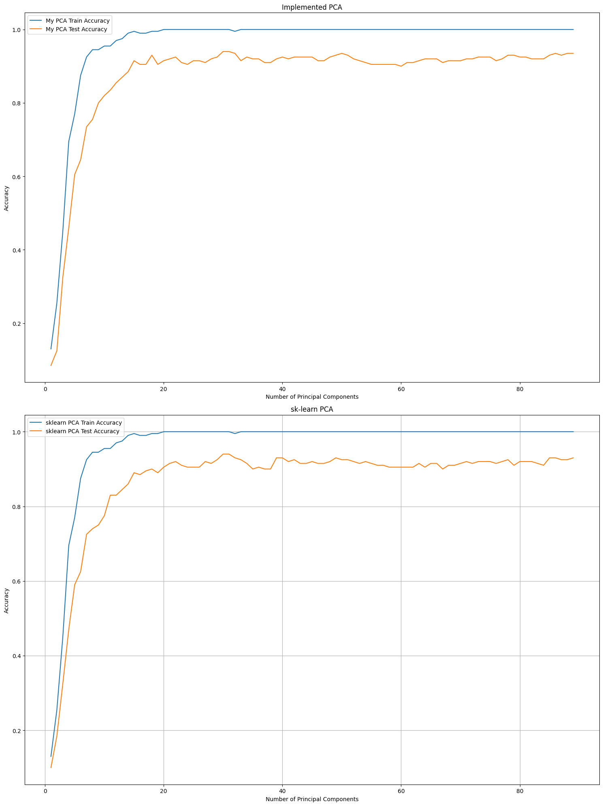
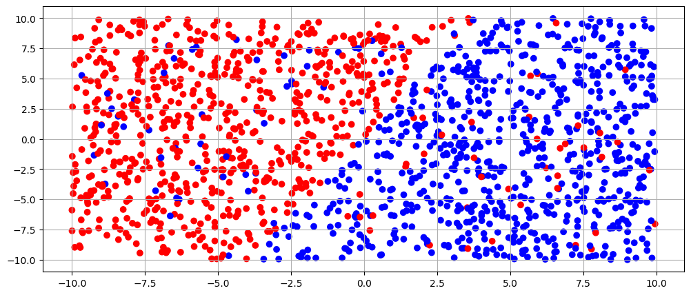
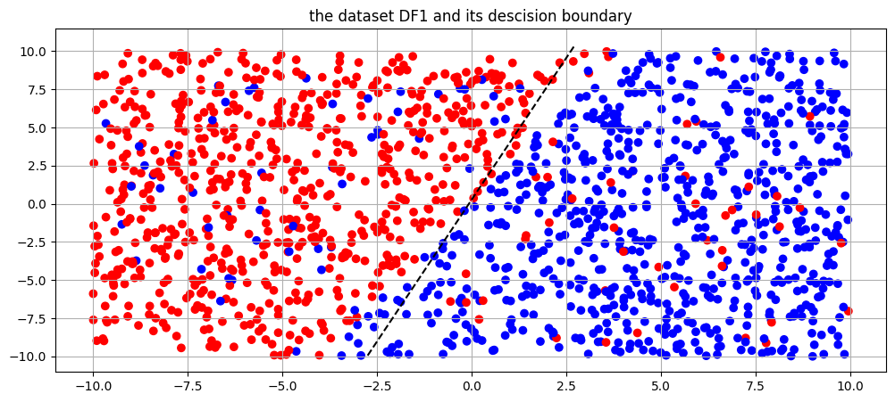
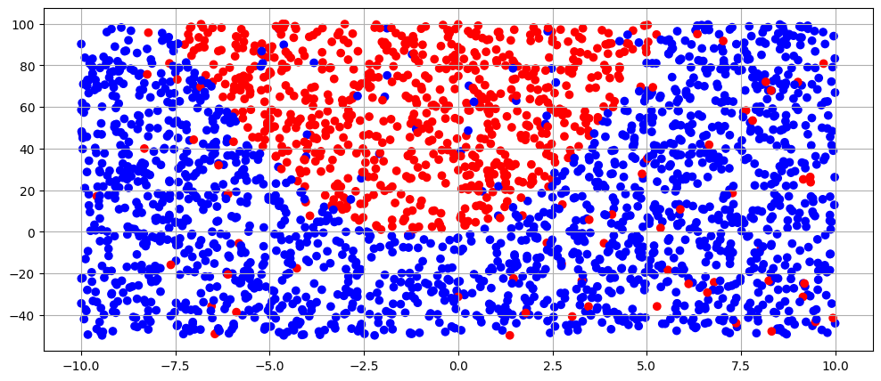
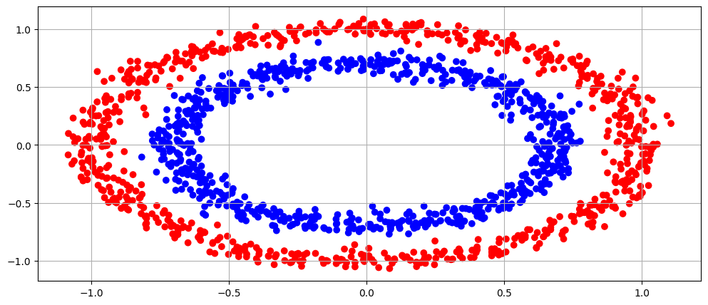
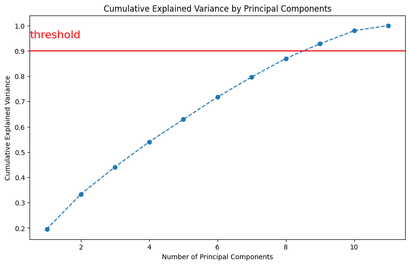
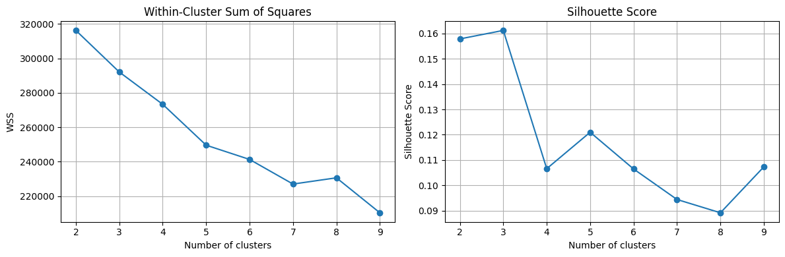
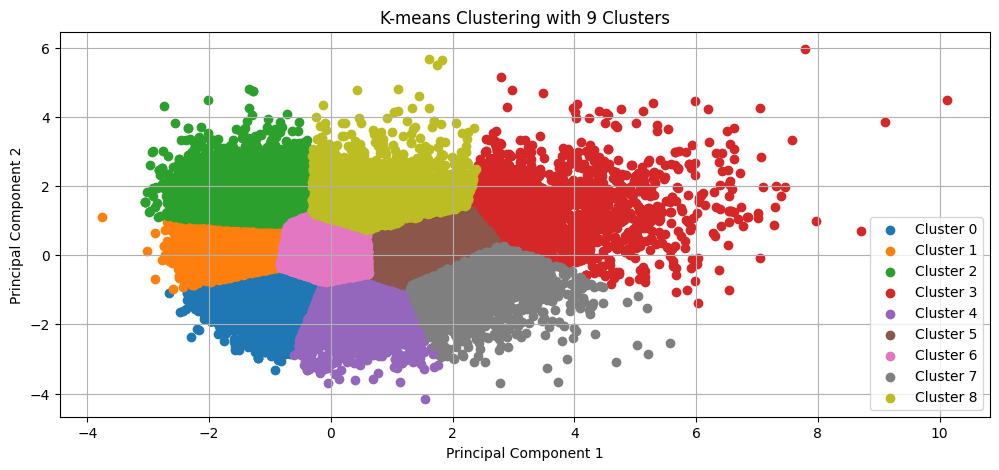
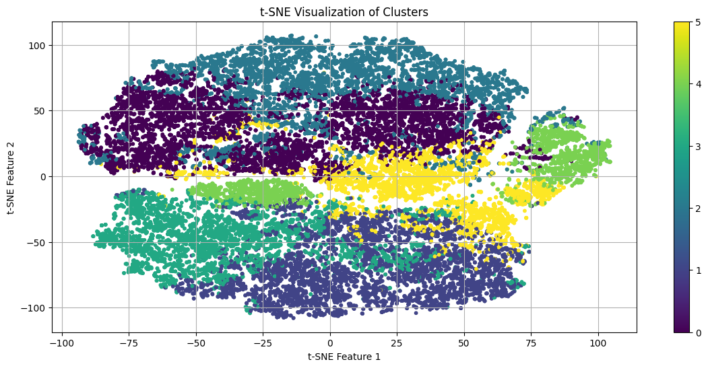

# HW3 — PCA, SVM, and Clustering

## Overview

This homework contains three classical machine learning parts:

1. **Principal Component Analysis (PCA)** on IRIS and face-recognition data  
2. **Support Vector Machines (SVM)** with linear, RBF, and polynomial kernels  
3. **K-means clustering** on Spotify song features  

The main goal was to implement and analyze dimensionality reduction, kernel-based classification, and unsupervised clustering.

---

## Part 1 — PCA

In this part, PCA was implemented from scratch using NumPy and compared with `sklearn` PCA.

### PCA Method

The implemented PCA follows these steps:

1. Center the data.
2. Compute the covariance matrix.
3. Apply SVD.
4. Select the top principal components.
5. Project the data onto the selected components.

For the IRIS dataset, PCA reduced the data to 2 dimensions and produced a clear 2D projection of the three classes.

<div align="center">

<table>
<tr>
<td align="center">
<br>
<b>Figure 1.</b> My PCA on IRIS dataset
</td>
<td align="center">
<br>
<b>Figure 2.</b> Face recognition accuracy using implemented PCA and sklearn PCA
</td>
</tr>
</table>

</div>

### Face Recognition with Eigenfaces

For the face dataset, PCA was used to build an eigenface-style representation.  
An LDA classifier was then trained on PCA-transformed features.

The result showed that using enough principal components improves recognition accuracy, and the implemented PCA behaved similarly to sklearn PCA.

---

## Part 2 — Support Vector Machines

This part implemented soft-margin SVM and used different kernels for three datasets:

| Dataset | Kernel Used | Reason |
|---|---|---|
| DF1 | Linear kernel | Data is approximately linearly separable |
| DF2 | RBF kernel | Data has a nonlinear structure |
| DF3 | Polynomial kernel | Data has a curved/ring-like structure |

The soft-margin SVM primal objective is:

$$
\min_{w,b,\xi} \frac{1}{2}\|w\|^2 + C \sum_i \xi_i
$$

subject to:

$$
y_i(w^T x_i + b) \geq 1 - \xi_i.
$$

The kernel trick replaces inner products with kernel functions, allowing nonlinear decision boundaries.

### SVM Results

| Dataset | Kernel | Test Accuracy |
|---|---|---:|
| DF1 | Linear | 92% |
| DF2 | RBF | 90% |
| DF3 | Polynomial | 100% |

<div align="center">

<table>
<tr>
<td align="center">
<br>
<b>Figure 3.</b> DF1 dataset
</td>
<td align="center">
<br>
<b>Figure 4.</b> Linear SVM boundary for DF1
</td>
</tr>
<tr>
<td align="center">
<br>
<b>Figure 5.</b> DF2 nonlinear dataset
</td>
<td align="center">
<br>
<b>Figure 6.</b> Polynomial kernel SVM boundary for DF3
</td>
</tr>
</table>

</div>

The polynomial kernel achieved the best result on DF3 because the data has a ring-like nonlinear structure.

---

## Part 3 — K-means Clustering on Spotify Data

This part performed clustering on Spotify song features.

Selected features included:

```text
danceability, energy, key, loudness, mode, speechiness,
acousticness, instrumentalness, liveness, valence, tempo
```

Before clustering, the data was standardized so that all features contributed fairly to distance calculations.

### PCA Before Clustering

PCA was used to reduce dimensionality. The cumulative explained variance plot was used to choose a suitable number of principal components.

<div align="center">

<table>
<tr>
<td align="center">
<br>
<b>Figure 7.</b> Cumulative explained variance
</td>
<td align="center">
<br>
<b>Figure 8.</b> WSS and silhouette score
</td>
</tr>
</table>

</div>

### K-means

K-means was implemented from scratch and tested with different numbers of clusters from 2 to 9.

The clustering quality was checked using:

| Metric | Purpose |
|---|---|
| WSS | Measures compactness inside clusters |
| Silhouette score | Measures how well-separated clusters are |

<div align="center">

<table>
<tr>
<td align="center">
<br>
<b>Figure 9.</b> K-means clustering with 9 clusters
</td>
<td align="center">
<br>
<b>Figure 10.</b> t-SNE visualization of clusters
</td>
</tr>
</table>

</div>

The t-SNE plot gives a qualitative view of how the discovered clusters are distributed in 2D.

---

## Summary

| Part | Method | Dataset | Main Result |
|---|---|---|---|
| PCA | Implemented PCA + sklearn PCA | IRIS / Faces | PCA reduced dimensionality and preserved useful structure |
| SVM | Linear, RBF, Polynomial kernels | DF1, DF2, DF3 | Best result: 100% accuracy on DF3 |
| Clustering | K-means from scratch | Spotify songs | PCA + K-means produced interpretable clusters |

---

## Conclusion

This homework covered three important machine learning tools: PCA for dimensionality reduction, SVM for kernel-based classification, and K-means for clustering. PCA helped reduce data dimensions while preserving useful structure, SVM handled both linear and nonlinear classification problems, and K-means provided an unsupervised way to group Spotify songs based on audio features.