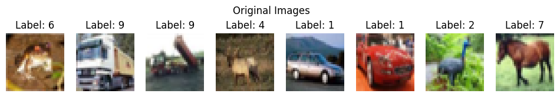
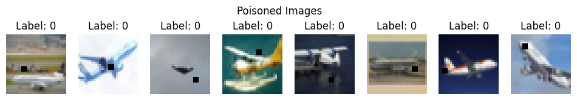
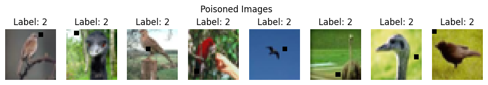

# HW4 — Machine Unlearning and Backdoor Attacks

## Overview

This homework studies **machine unlearning** using the SISA training framework and evaluates it under normal and poisoned training settings.

The project has three main parts:

1. Training CIFAR-10 classifiers using **SISA**  
2. Performing **machine unlearning** and evaluating Membership Inference Attack behavior  
3. Testing **backdoor poisoning attacks** and checking whether unlearning reduces the attack effect  

---

## Dataset and Model

The experiments were performed on the CIFAR-10 dataset.

| Item | Value |
|---|---:|
| Dataset | CIFAR-10 |
| Training samples | 50,000 |
| Test samples | 10,000 |
| Number of classes | 10 |
| Base model | Modified ResNet18 |
| Optimizer | Adam |
| Learning rate | 0.001 |
| Weight decay | 35e-5 |

A modified `ResNet18` was used by replacing the final fully connected layer with a 10-class output layer for CIFAR-10.

---

## Part 1 — SISA Training

SISA stands for:

```text
Sharded, Isolated, Sliced, and Aggregated
```

The dataset is divided into `S` shards, and each shard is further divided into `R` slices. Separate models are trained on different slices, and the final prediction is produced by aggregating the outputs of the models.

The main aggregation methods were:

| Aggregation Method | Description |
|---|---|
| Majority Voting | Combines model predictions by voting |
| Adaptive Aggregation | Weights model outputs based on output norms |
| Hierarchical Aggregation | Averages model probabilities |

For the main experiment:

| Parameter | Value |
|---|---:|
| Number of shards `S` | 5 |
| Number of slices `R` | 5 |
| Epochs | 10 |

Initial clean test results for one run were approximately:

| Aggregation | Accuracy | F1 Score | AUROC |
|---|---:|---:|---:|
| Majority Voting | 0.9137 | 0.9132 | 0.9948 |
| Adaptive Aggregation | 0.9137 | 0.9132 | 0.9948 |
| Hierarchical Aggregation | 0.9137 | 0.9132 | 0.9948 |

---

## Part 2 — Machine Unlearning

Machine unlearning was implemented by selecting a forget set and retraining only the affected shards/slices instead of retraining the whole model from scratch.

After unlearning, the test accuracy stayed close to the original performance:

| Aggregation | Accuracy After Unlearning | F1 Score | AUROC |
|---|---:|---:|---:|
| Majority Voting | 0.9171 | 0.9171 | 0.9953 |
| Adaptive Aggregation | 0.9171 | 0.9171 | 0.9953 |
| Hierarchical Aggregation | 0.9171 | 0.9171 | 0.9953 |

Membership Inference Attack behavior was also checked. A perfectly unlearned model should make membership inference close to random guessing, around 0.5. In the experiments, several MIA scores moved closer to this range after unlearning, showing that SISA can reduce memorization of the forget set.

---

## Part 3 — Backdoor Poisoning Attack

A backdoor attack was created by inserting a small black square trigger into selected CIFAR-10 images and changing their labels to a target class.

| Setting | Value |
|---|---:|
| Poisoned samples | 500 |
| Poisoned dataset size | 50,000 |
| Trigger | Small black square patch |
| Target labels tested | 0 and 2 |

### Target Label 0 Example

<p align="center">
  
</p>

<p align="center">
  
</p>

**Figure 1.** Original CIFAR-10 images and poisoned images with a black-square trigger. In this experiment, poisoned samples were assigned target label `0`.

### Target Label 2 Example

<p align="center">
  
</p>

<p align="center">
  
</p>

**Figure 2.** Original CIFAR-10 images and poisoned images with the trigger. In this experiment, poisoned samples were assigned target label `2`.

---

## Backdoor Results

Attack Success Rate, or ASR, measures the percentage of poisoned samples classified as the attacker’s target label.

### Target Label 0

| Stage | ASR |
|---|---:|
| Before unlearning | 81.8% |
| After unlearning | 12.0% |

### Target Label 2

| Stage | ASR |
|---|---:|
| Before unlearning | 84.4% |
| After unlearning | 5.0% |

The results show that unlearning greatly reduced the effect of the backdoor trigger.

---

## Summary

| Part | Method | Main Result |
|---|---|---|
| SISA Training | Shard, slice, train, aggregate | Clean accuracy around 91% in the stronger run |
| Unlearning | Retrain affected shards/slices | Accuracy stayed stable after forgetting |
| MIA Evaluation | Logistic regression attack | Some scores moved closer to random guessing |
| Backdoor Attack | Trigger poisoning on CIFAR-10 | ASR above 80% before unlearning |
| Backdoor Removal | SISA-based unlearning | ASR dropped to 12% for target 0 and 5% for target 2 |

---


## Conclusion

This homework explored machine unlearning with SISA on CIFAR-10. The model was trained using sharded and sliced data, then selected samples were forgotten by retraining only the affected parts. The experiments showed that SISA can preserve test performance while reducing information about forgotten samples.

The backdoor experiments showed that a small trigger can strongly affect model predictions, but after unlearning the poisoned samples, the attack success rate decreased significantly.